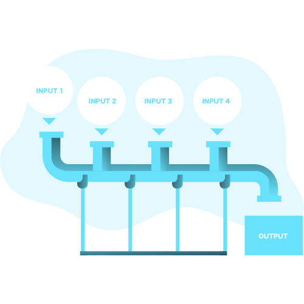

<p align="center">
  
</p>

# Aggregates

[](http://badge.fury.io/rb/aggregates)
[](https://rubystyle.guide)

<!-- Tocer[start]: Auto-generated, don't remove. -->

## Table of Contents

  - [Features](#features)
  - [Requirements](#requirements)
  - [Setup](#setup)
  - [Usage](#usage)
    - [Defining AggregateRoots](#defining-aggregateroots)
    - [Creating Commands](#creating-commands)
    - [Creating Events](#creating-events)
    - [Processing Commands](#processing-commands)
    - [Processing Events](#processing-events)
    - [Executing Commands](#executing-commands)
    - [Auditing Aggregates](#auditing-aggregates)
    - [Configuring](#configuring)
      - [Storage Backends](#storage-backends)
        - [Dynamoid](#dynamoid)
      - [Adding Command Processors](#adding-command-processors)
      - [Adding Event Processors](#adding-event-processors)
  - [Development](#development)
  - [Tests](#tests)
  - [Versioning](#versioning)
  - [Code of Conduct](#code-of-conduct)
  - [Contributions](#contributions)
  - [License](#license)
  - [History](#history)
  - [Credits](#credits)

<!-- Tocer[finish]: Auto-generated, don't remove. -->

## Features

- Pluggable Event / Command Storage Backend
- Tools for Command Validation and Execution.
- Opinioned structure for CQRS programming.

## Requirements

1. [Ruby](https://www.ruby-lang.org)

## Setup

To install, run:

    gem install aggregates

Or Add the following to your Gemfile:

    gem "aggregates"

## Usage

### Defining AggregateRoots

```ruby
class Post < Aggregates::AggregateRoot
  # Write functions that encapsulate business logic that comes from command.
  def publish(command)
    apply EventPublished, body: command.body, category: command.category
  end
  
  # Before the event is processed, perform modifications to the aggregate.
  on EventPublished do |event|
    @body = event.body
    @category = event.category
  end
end
```

### Creating Commands

```ruby
class PublishPost < Aggregates::Command
  attribute body, Types::String
  attribute category, Type::String
  
  # Input Validation Handled via dry-validation.
  # Reference: https://dry-rb.org/gems/dry-validation/1.6/
  class Contract < Contract
    rule(:body) do
      unless value.length > 10
        key.failure('Post not long enough')
      end
    end
  end
end
```

### Creating Events

```ruby
class PublishPost < Aggregates::Command
  attribute body, Types::String
  attribute category, Type::String
end
```

### Processing Commands

```ruby
class PostCommandProcessor < Aggregates::CommandProcessor
  on PublishPost do |command|
    with_aggregate(Post, command) do |post|
      post.publsh(command)
    end
  end
end
```

### Processing Events

```ruby
class RssUpdateProcessor < Aggregates::EventProcessor
  def update_feed_for_new_post
    # ...
  end
  
  on EventPublished do |event|
    update_feed_for_new_post(event)
  end
end
```

### Executing Commands

```ruby
aggregate_id = Aggregates.new_aggregate_id
command = CreateThing.new(foo: 1, bar: false, aggregate_id: aggregate_id)
Aggregates.execute_command command

increment = IncrementFooThing.new(aggregate_id: aggregate_id)
toggle = ToggleBarThing.new(aggregate_id: aggregate_id)
Aggregates.execute_commands increment, toggle
```

### Auditing Aggregates

```ruby
aggregate_id = Aggregates.new_aggregate_id
# ... Commands and stuff happened.
auditor = Aggregates.audit MyAggregateType aggregate_id

# Each of these returns a list to investigate using.
events = auditor.events # Or events_processed_by(time) or events_processed_after(time)
commands = auditor.commands # Or commands_processed_by(time) or commands_processed_after(time)

# Or....
# View the state of an aggregate at a certain pont in time.
aggregate_at_time = auditor.inspect_state_at(Time.now - 1.hour)
```

### Configuring 

#### Storage Backends

Storage Backends at the method by which events and commands are stored in 
the system. 

```ruby
Aggregates.configure do |config|
  config.store_with MyAwesomeStorageBackend.new
end
```
##### Dynamoid

If `Aggregates` can `require 'dynamoid'` then it will provide the `Aggregates::Dynamoid::DynamoidStorageBackend` that
stores using the [Dynmoid Gem](https://github.com/Dynamoid/dynamoid) for AWS DynamoDB.

#### Adding Command Processors

```ruby
Aggregates.configure do |config|
  # May call this method many times with different processors.
  config.process_commands_with PostCommandProcessor.new
end
```

#### Adding Event Processors 

```ruby
Aggregates.configure do |config|
  # May call this method many times with different processors.
  config.process_events_with RssUpdateProcessor.new
end
```

## Development

To contribute, run:

    git clone https://github.com//aggregates.git
    cd aggregates
    bin/setup

You can also use the IRB console for direct access to all objects:

    bin/console

## Tests

To test, run:

    bundle exec rake

## Versioning

Read [Semantic Versioning](https://semver.org) for details. Briefly, it means:

- Major (X.y.z) - Incremented for any backwards incompatible public API changes.
- Minor (x.Y.z) - Incremented for new, backwards compatible, public API enhancements/fixes.
- Patch (x.y.Z) - Incremented for small, backwards compatible, bug fixes.

## Code of Conduct

Please note that this project is released with a [CODE OF CONDUCT](CODE_OF_CONDUCT.md). By
participating in this project you agree to abide by its terms.

## Contributions

Read [CONTRIBUTING](CONTRIBUTING.md) for details.

## License

Copyright 2021 [Resilient Vitality](www.resilientvitality.com).
Read [LICENSE](LICENSE.md) for details.

## History

Read [CHANGES](CHANGES.md) for details.
Built with [Gemsmith](https://www.alchemists.io/projects/gemsmith).

## Credits

Developed by [Zach Probst](mailto:zprobst@resilientvitality.com) at [Resilient Vitality](www.resilientvitality.com).
